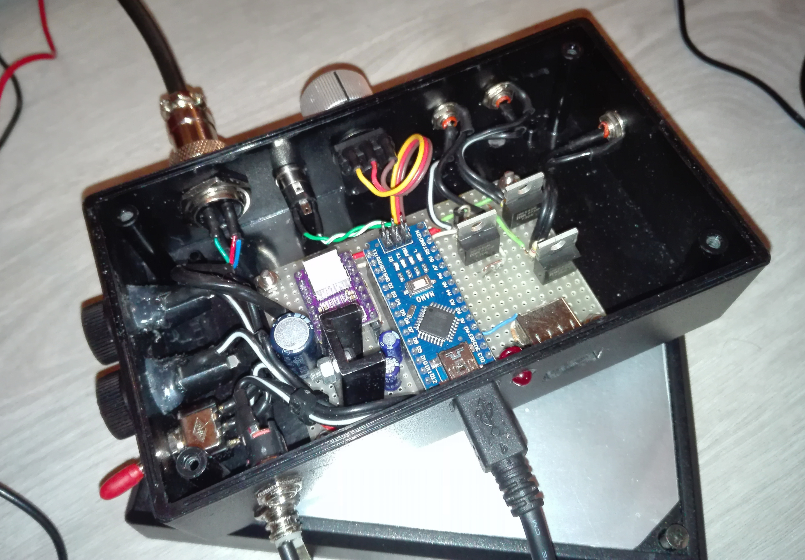
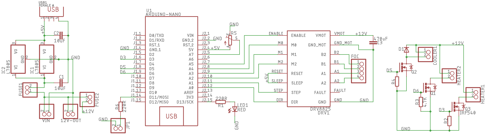

# Arduino-based telescope focuser controller
Simple MoonLite-compatible motorized focuser controller. Thought to be used with INDI.
Doesn't support temperature compensation.
It also supports a non-official MoonLite-style command to change the state of all the
Arduino's digital and PWM pins: in my case I control two dew heaters and a fan to cool the primary mirror.

### MoonLite focuser
I use a Nema 11 motor that moves the focuser knob using a belt.
If you don't have a heavy focuser, also consider using a Nema 8.
A 20 teeth pulley and a 6mm wide 160mm long belt are enough.
Absolute and relative positioning, half and full step switching.

### Pin management
Define the customizable pins in the `CUSTOMIZABLE_PINS` array in the `Config.h` file and
upload the firmware.

#### AstroAllInOne
<a href="https://github.com/SquareBoot/AstroAllInOne">AstroAllInOne</a>
is this firmware's companion INDI driver that allows the end user to
change the state of **every** pin of the board (pay attention! **do not change the
state of the stepper motor driver's pins**). Refer to its documentation on
how to configure it. Without AstroAllInOne, the Arduino will behave just like
a generic MoonLite focuser controller.

### Polar finder illuminator
For my EQ5 I needed an illuminator and I added it to the focuser project.
It requires a potentiometer to dim the light and a red LED.
Can be easily disabled in the `Config.h` file by setting the `ENABLE_POLAR_LIGHT` field.

### Autodesk Eagle project
In the "Eagle" directory you can find the full circuit project, both schematics and PCB. 
It's the one I use for my telescope, but feel free to modify it to 
accomplish your necessities: for instance, you could add another dew heater controller, 
or remove the Newton mirror cooler MOSFET.
 **Made with Eagle 9.2.2 Premium**
 

### Mounting brackets
I included the mounting brackets I made for the common SkyWatcher 
dual-speed Crayford focuser (I have a 200mm f/5 Newton OTA).

**AutoCAD 2019** project, STL and IGS exported files.

### Forking & issues
Feel free to submit pull requests! New brackets are welcome!
